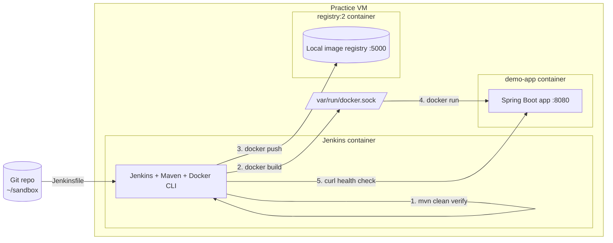

# Docker + Jenkins + Java Practice Project

A small Spring Boot app used to practice the classic CI/CD loop: build the app,
containerize it with Docker, and automate build → test → image → deploy with
Jenkins.

## Architecture

Jenkins runs the whole pipeline itself: it checks out the code, compiles/tests
it with Maven, then talks to the **host's** Docker daemon (via the mounted
`docker.sock`) to build the image, push it to a local registry, and run it as
a sibling container — all without needing a separate build agent.

## What each file is for

| File | Why it exists |
|---|---|
| `pom.xml` | Maven's project file. Tells Maven which dependencies to pull in (Spring Web, Actuator, Test) and how to package the app into a runnable jar. |
| `src/main/java/.../DemoApplication.java` | The entry point that boots the Spring Boot application. |
| `src/main/java/.../HelloController.java` | A minimal REST endpoint (`GET /hello`) so the pipeline has something real to build, test, and verify. |
| `src/test/java/.../HelloControllerTests.java` | A basic automated test that calls `/hello` and checks the response — gives the Jenkins pipeline something meaningful to run in the "Build & Test" stage. |
| `Dockerfile` | Recipe for packaging the **app itself** into a Docker image. Uses a multi-stage build: one stage compiles the jar with Maven, the second copies just the jar into a slim Java runtime image (keeps the final image small). |
| `Dockerfile.jenkins` | Recipe for building a **custom Jenkins image**. The stock `jenkins/jenkins:lts` image doesn't include Maven or the Docker CLI, both of which the pipeline needs to run on the Jenkins agent itself. |
| `Jenkinsfile` | The actual CI/CD pipeline definition (Jenkins Pipeline-as-Code). Defines the stages: checkout → build & test → docker build → docker push → deploy & verify. |
| `jenkins-job-config.xml` | Jenkins' internal job configuration XML, describing the Pipeline job (`demo-app-pipeline`) and pointing it at the `Jenkinsfile` in this repo. Used to create the job without clicking through the UI. |
| `.dockerignore` / `.gitignore` | Keep build output (`target/`) and other noise out of Docker build contexts and git history. |

## Why Docker-outside-of-Docker (DooD)

Jenkins runs in its own container but needs to build/run Docker images. Instead
of running a separate Docker daemon inside Jenkins (Docker-in-Docker), this
setup mounts the **host's** `/var/run/docker.sock` into the Jenkins container.
Jenkins then talks to the same Docker engine the host uses, and any containers
it starts (like `demo-app`) are **siblings** of the Jenkins container, not
children of it — which is why the pipeline has to reach the app container by
its own container IP rather than `localhost`.

## Practice flow

1. **Local build** — `mvn test` / `mvn package` to make sure the app works
   before involving Docker at all.
2. **Manual Docker practice** — build the image by hand, run it, curl it, push
   it to a local `registry:2` container, pull it back down. This builds the
   core Docker muscle memory.
3. **Jenkins in Docker** — run Jenkins itself as a container, with Maven and
   the Docker CLI baked into a custom image.
4. **Pipeline as code** — the `Jenkinsfile` automates the same steps done
   manually in step 2.
5. **Wire it up** — a Jenkins Pipeline job runs the `Jenkinsfile` against this
   repo, end to end.
